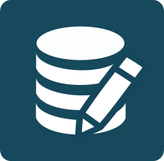
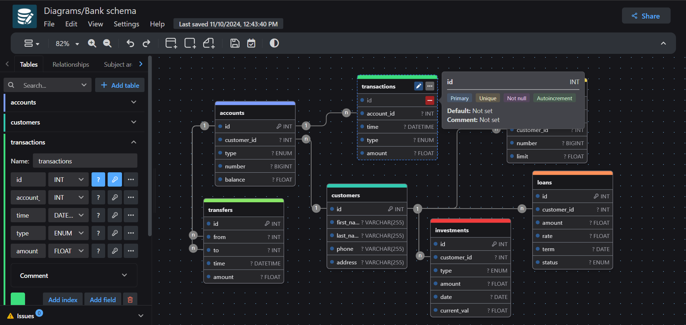

<div align="center">
    
    <h1>drawDB</h1>
</div>

<h3 align="center">Free, simple, and intuitive database schema editor and SQL generator.</h3>

<div align="center" style="margin-bottom:12px;">
    <a href="https://draw-db-three.vercel.app/" style="display: flex; align-items: center;">
        
    </a>
    <a href="https://drawdb.app/" style="display: flex; align-items: center;">
        
    </a>
    <a href="https://discord.gg/BrjZgNrmR6" style="display: flex; align-items: center;">
        
    </a>
    <a href="https://x.com/drawDB_" style="display: flex; align-items: center;">
        
    </a>
</div>

<h3 align="center"></h3>

DrawDB is a robust and user-friendly database entity relationship diagram (ERD) editor right in your browser. Build diagrams with a few clicks, export and import SQL scripts, generate migrations, customize your editor, and more without creating an account.

## Live Demo

A live deployment of this UI-customized fork is available here:

**[https://draw-db-three.vercel.app/](https://draw-db-three.vercel.app/)**

## About This Fork

This repository is a UI-customized fork of the original [drawDB](https://github.com/drawdb-io/drawdb) project, created and maintained by the drawDB team. The core functionality and architecture remain the same — the changes here are purely visual, with the interface restyled to suit personal preferences. Full credit for the original tool goes to the drawDB team.

## Features

- Drag-and-drop ERD canvas
- Export and import SQL scripts for MySQL, PostgreSQL, SQLite, and more
- Generate migrations
- Customize themes, layouts, and editor behavior
- No account required — everything runs in your browser

See the full set of features on [the official site](https://drawdb.app/).

## Getting Started

### Local Development

```bash
git clone https://github.com/drawdb-io/drawdb
cd drawdb
npm install
npm run dev
```

### Build

```bash
git clone https://github.com/drawdb-io/drawdb
cd drawdb
npm install
npm run build
```

### Docker Build

```bash
docker build -t drawdb .
docker run -p 3000:80 drawdb
```

If you want to enable sharing, set up the [server](https://github.com/drawdb-io/drawdb-server) and environment variables according to `.env.sample`. This is optional unless you need to share files.

## Contributing

Please see [CONTRIBUTING.md](CONTRIBUTING.md) for guidelines on how to contribute to this project.

## Support

- Join discussions: [Discord](https://discord.gg/BrjZgNrmR6)
